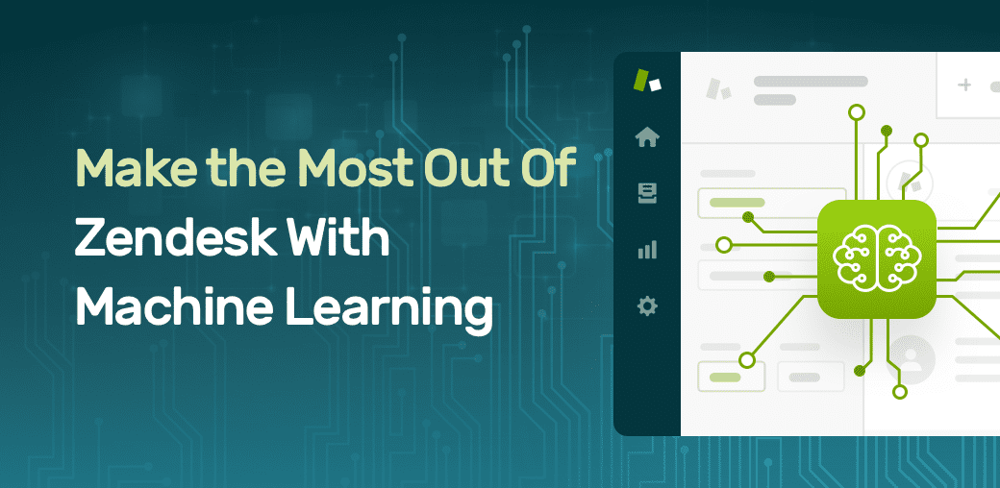

# Task5

## Zendesk Brings The Power Of Machine Learning To Customer Service With Automatic Answers

Companies Can Now Effortlessly Provide Fast, Accurate Responses to their Customers
RELATE LIVE CONFERENCE, Sydney, Australia — July 14, 2016 — Zendesk, Inc. (NYSE: ZEN) today announced the launch of Automatic Answers, a feature powered by machine learning within Zendesk that helps customers solve their inquiries faster and enables businesses to have more efficient support teams. Zendesk is one of the first customer service platforms implementing machine learning to natively auto-respond to customer tickets with relevant knowledge base articles, helping solve and deflect customer inquiries before they ever reach an agent.

“Zendesk continues to innovate its machine learning capabilities to help businesses provide effortless customer engagement,” said Adrian McDermott, senior vice president of product development at Zendesk. “Automatic Answers’ predictive capabilities provide customers with the resources they need to solve their issue quickly, and helps businesses free up their agents to focus on inquiries that need a human touch.”

___

"Companies used to have a manual process wi ..

Automatic Answers enables forward-thinking companies to help their customer service agents become more effective, allowing them to devote valuable time and resources to critical issues. Before, agents had to manually respond and solve simple, repetitive customer tickets. With Automatic Answers, the feature uses machine learning capabilities to analyze customer and agent actions over time, learning which articles solve tickets associated with specific keywords and topics. If a customer indicates their inquiry has been solved successfully, the ticket is closed. For tickets that remain unsolved, they proceed to the customer service team as normal.

## Zendesk’s AI Toolkit
While Zendesk has seamless multi-channel support, automation, and analytical abilities, there are many AI companies that have built powerful tools with integrations for Zendesk. 

Let’s take a look at some of these tools and integrations in more detail:

## AI Ticketing
There’s lots of hype when it comes to chatbots, but there are other ways in which AI is powering customer service teams, including AI ticketing. 

AI ticketing is the process of automatically tagging and routing incoming tickets. It’s a process that customer agents are all too familiar with. When they receive tickets, they need to sort them by tagging them with relevant categories, after which they send them to the appropriate team member to deal with the customer issue or query. Well, this tedious and often frustrating task is slowly being replaced by AI ticketing tools that use text analysis. 

Zendesk’s customer support platform can easily be integrated with AI ticket tagging tools such as MonkeyLearn that use text analysis to help support teams automatically classify tickets based on their content, and extract important information. Depending on the problem you’re trying to solve, there are a range of text analysis models you can use, some of which we’ve outlined below:

Sentiment Analysis
Sentiment analysis is the rising star of the text analysis world. It’s a quick and easy way to find out how your service, product, or a particular aspect of your business, such as customer service, is perceived by your customers. Do they mostly talk about your customer service in a negative or positive way, for example? A sentiment analysis tool recognizes words and expressions, such as poor, bad service, disappointed, excellent, easy to use, as either negative or positive to come to a conclusion. 

Within Zendesk, you can use MonkeyLearn’s pre-built sentiment analysis model, or you can build your own custom model with your own data and criteria. Either way, those incoming tickets will soon be classified by sentiment and you’ll be able to use Zendesk’s analytical tools to make sense of this ‘classified’ data.

Topic classification
This is a great way to delve deeper into conversations with customers. You can hone in on exactly what your customers are talking about in support tickets, emails, or chat conversations. 

Let’s say you automatically convert public tweets that mention your Twitter handle (for example, @zendesk) into tickets, and you run a sentiment analysis model on your tweets using the Zendesk MonkeyLearn integration. You receive a bunch of results that categorize your tweets as positive, neutral, and negative. Now, let’s say you want to know what these negative tweets mention, so that you can turn these negatives into positives, and prevent customer churn. You’d run a topic classification model.

## About Zendesk
Zendesk builds software for better customer relationships. It empowers organizations to improve customer engagement and better understand their customers. More than 75,000 paid customer accounts in 150 countries and territories use Zendesk products. Based in San Francisco, Zendesk has operations in the United States, Europe, Asia, Australia, and South America. Learn more at www.zendesk.com.

